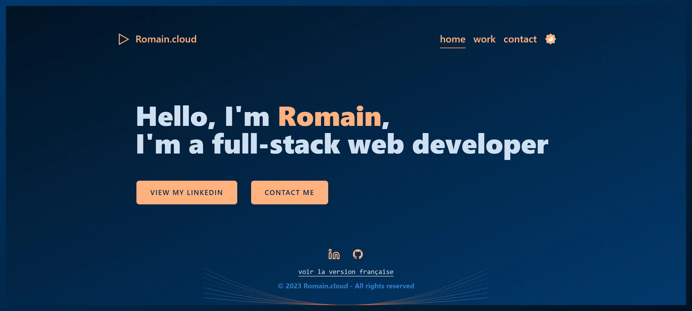

# Folio

> This is my personal promoting / landing / minimalist page.

## Todo

- [ ] add a lang flag switch
- [ ] add some illustrations (<https://iconpark.oceanengine.com/illustrations/18> maybe ?)
- [ ] migrate to "eslint": "*" & "eslint-plugin-shuunen": "0.3" ? (wait until site is complete)
- [ ] bring back repo-check in check task (after eslint 9 migration)
- [ ] use [flowbite](https://flowbite.com/docs/getting-started/next-js/)
- [ ] use dependency-cruiser

## Thanks

- [Boxy SVG](https://boxy-svg.com) : for providing a simple & full featured svg editor
- [Claude](https://claude.ai) : great AI companion for various tasks
- [Dependency-cruiser](https://github.com/sverweij/dependency-cruiser) : handy tool to validate and visualize dependencies
- [DoYouBuzz](https://doyoubuzz.com) : for their awesome resume builder that I use to generate the JSON resume file
- [Eslint](https://eslint.org) : super tool to find & fix problems
- [Feather Icons](https://feathericons.com) : nice looking svg icons
- [Github](https://github.com) : for all their great work year after year, pushing OSS forward
- [Gtmetrix](https://gtmetrix.com) : great tool to check & monitor websites performances
- [IconPark](https://iconpark.oceanengine.com/official): nice svg icons and [illustrations](https://iconpark.oceanengine.com/illustrations/18)
- [Netlify](https://netlify.com) : awesome company that offers hosting for OSS
- [Next.js](https://nextjs.org) : super fast frontend framework powering this website
- [Nnnoise](https://fffuel.co) : sexy svg noise texture generator
- [Open AI](https://chat.openai.com/) : also a great AI companion for various tasks
- [Pnpm](https://pnpm.io) : fast, disk space efficient package manager
- [React](https://react.dev) : great library for building user interfaces
- [Repo-checker](https://github.com/Shuunen/repo-checker) : eslint cover /src code and this tool the rest ^^
- [RIOT Optimizer](https://riot-optimizer.com) : Radical Image Optimization Tool, the best software I found to compress images
- [Servor](https://github.com/lukejacksonn/servor) : dependency free dev server for single page app development
- [Shields.io](https://shields.io) : super platform centralizing badges
- [Shuutils](https://github.com/Shuunen/shuutils) : collection of pure JS utils
- [SvgOmg](https://jakearchibald.github.io/svgomg) : awesome tool to optimize svg files
- [TailwindCss](https://tailwindcss.com) : awesome lib to produce maintainable style
- [Tsconfig strictest](https://www.npmjs.com/package/@tsconfig/strictest) : a good & strict tsconfig baseline
- [V8](https://github.com/demurgos/v8-coverage) : simple & effective cli for code coverage
- [Vitest](https://github.com/vitest-dev/vitest) : super fast vite-native testing framework
- [Web App Manifest Generator](https://app-manifest.firebaseapp.com) : generate manifest.json easily
