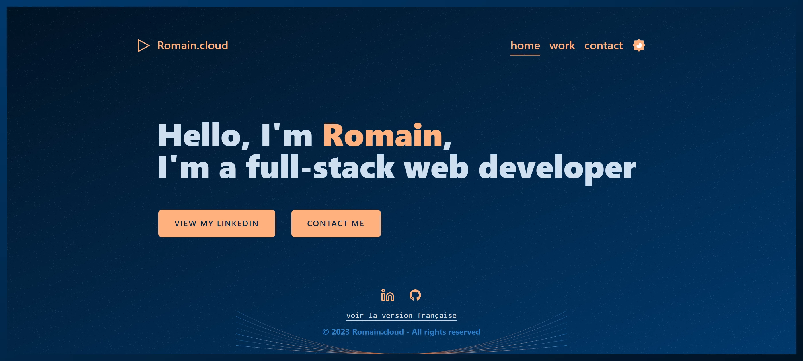

# Folio

> This is my personal promoting / landing / minimalist page.

## Json Resume Themes

`pnpm render` renders every resume in `data/` to html & pdf with each theme below, output lands in `dist/resumes/` along with an `index.html` listing them as cards, browse it with `pnpm dev`.

`--theme <name>` narrows the render to one or more themes, repeat it or separate the names with commas, and `pnpm render:blue` is the shortcut for rendering every resume with `blue-buzz`. Note that the `index.html` is rebuilt from what the run produced, so a narrowed render leaves it listing only those cards until the next full `pnpm render`.

The pdf export drives Chrome through Puppeteer, `pnpm install` downloads it, set `PUPPETEER_EXECUTABLE_PATH` to use another browser.

`blue-buzz` is the custom theme living in `src/themes/blue-buzz`, it mimics the [DoYouBuzz](https://www.doyoubuzz.com/romain-racamier) "minimal" design : blue `#50a3d9` accent, Open Sans, profile on top then a 70/30 columns body, and it localizes its section titles in english or french depending on the resume. Use it standalone with `resumed render "data/my resume.json" --theme jsonresume-theme-blue-buzz`.

- src/themes/blue-buzz (custom)
- <https://registry.jsonresume.org/thomasdavis?theme=berlin-grid>
- <https://registry.jsonresume.org/thomasdavis?theme=tokyo-modernist>
- <https://registry.jsonresume.org/thomasdavis?theme=modern-classic>

## Checks

`pnpm check` types, formats & lints the code, runs the test suite, and validates every resume in `data/` twice : with `resumed validate` against the official schema, and with `src/bin/json-resume-validator.cli.ts` for what the schema does not enforce, a name, at least one filled section, and the typography of every prose string. It is what CI runs.

`data/keyword.txt` lists the words `blue-buzz` emphasizes wherever they appear in a free text, one per line, `#` starts a comment.

## Todo

See [TODOS.md](TODOS.md).

## Thanks

- [Boxy SVG](https://boxy-svg.com/) : simple & effective svg editor
- [Dependency-cruiser](https://github.com/sverweij/dependency-cruiser) : handy tool to validate and visualize dependencies
- [DoYouBuzz](https://doyoubuzz.com) : for their awesome resume builder that I use to generate the JSON resume file
- [Eslint](https://eslint.org) : super tool to find & fix problems
- [Feather Icons](https://feathericons.com) : nice looking svg icons
- [Github](https://github.com) : for all their great work year after year, pushing OSS forward
- [Gtmetrix](https://gtmetrix.com) : great tool to check & monitor websites performances
- [IconPark](https://iconpark.oceanengine.com/official): nice svg icons and [illustrations](https://iconpark.oceanengine.com/illustrations/18)
- [JSON Resume](https://jsonresume.org) : open standard for resumes
- [Netlify](https://netlify.com) : awesome company that offers hosting for OSS
- [Nnnoise](https://fffuel.co) : sexy svg noise texture generator
- [Repo-checker](https://github.com/Shuunen/repo-checker) : eslint cover /src code and this tool the rest ^^
- [Shields.io](https://shields.io) : super platform centralizing badges
- [Shuutils](https://github.com/Shuunen/shuutils) : collection of pure JS utils
- [Svg Omg](https://jakearchibald.github.io/svgomg/) : the great king of svg file size reduction
- [TailwindCss](https://tailwindcss.com) : awesome lib to produce maintainable style
- [V8](https://github.com/demurgos/v8-coverage) : simple & effective cli for code coverage
- [Vite](https://github.com/vitejs/vite) : super fast frontend tooling
- [Vitest](https://github.com/vitest-dev/vitest) : super fast vite-native testing framework
- [Vue](https://vuejs.org) : when I need a front framework, this is the one I choose <3
- [Web App Manifest Generator](https://app-manifest.firebaseapp.com) : generate manifest.json easily

## Stargazers over time

## Page views

